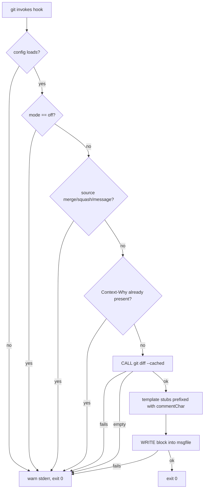

# CLI & Commit Hook Design v0.2

Status: Draft (v0.2 — trailer generation delegated to AI coding agents)
Depends on: [Context Trailer Format v0.1](trailer-format.md)

## Goal

Make `Context-*` trailers land on every commit with near-zero writing cost.
Two authoring paths, one enforcement point:

- **AI coding agents** (Claude Code, Codex, …) already write commit messages
  with the full diff in context. Given the convention once, they write the
  trailers too — no extra API call, no latency, no key management.
- **Humans** get an empty trailer template injected into the commit editor.

The `commit-msg` lint hook is the shared enforcement point: its violation
messages are exactly the feedback an AI agent needs to self-correct and
retry, and the nudge a human needs to fill the template.

### v0.2 change log

v0.1 had the hook call an LLM API directly to draft trailers from the staged
diff. Dropped: the commit author is increasingly an AI agent that already has
the diff and writes the message — a second LLM call duplicates work, adds
commit latency, and forces API-key management onto every user. With it went
the provider adapter, the `[ai]` config section, `hook.mode = "fill"`, the
`draft` subcommand, and the diff-privacy concern (nothing ever leaves the
machine).

## Invariants

- **I-1 Never block.** No tool failure (missing config, IO error) may block
  or break a commit. Every hook failure path prints a warning to stderr and
  exits 0. Sole exception: `commit-msg` lint with opt-in
  `lint.level = "strict"`.
- **I-2 Local only.** The tool makes no network calls. Nothing about the
  repository leaves the machine.
- **I-3 Never edit foreign files.** `init` writes only files it owns (marker
  line) or creates new ones; anything else yields printed instructions.

## Command surface

One binary, `context-diary`:

| Command | Purpose |
| --- | --- |
| `context-diary init` | Install git hooks (coexistence-safe), scaffold `.context-diary.toml`. |
| `context-diary init --agent <claude-code\|codex>` | Additionally set up the AI-agent convention file (below). |
| `context-diary instructions [claude-code\|codex]` | Print the trailer-writing instructions for agent config files. |
| `context-diary hook prepare-commit-msg <msgfile> [<source> [<sha>]]` | Git hook entry: inject the trailer template. |
| `context-diary hook commit-msg <msgfile>` | Git hook entry: lint the final message (warn-only by default). |
| `context-diary lint <rev-range>` | Validate trailers over a commit range (CI). Exit 1 on violations. |
| `context-diary scopes` | List known scopes (config). |

Reserved for later phases: `serve` (indexer), `mcp` (MCP server).

Hook scripts installed by `init` are one-liners delegating to the binary, so
upgrades never require re-installing hooks.

## AI coding agent integration

The generation loop costs nothing because the agent is already writing the
commit:

```
agent runs `git commit`
  └─ commit-msg hook lints the message
       ├─ clean → commit lands
       └─ violations → printed to stderr
            └─ strict: commit rejected → agent reads the violations,
               rewrites the message with trailers, retries
```

Two levers set this up:

1. **Convention instructions** — `context-diary instructions <agent>` prints
   a snippet for the agent's convention file (`CLAUDE.md` for Claude Code,
   `AGENTS.md` for Codex) that teaches the trailer format proactively.
   `init --agent <name>` creates that file with the snippet when it does not
   exist; when it exists, it prints the snippet for manual pasting (I-3).
2. **Strict lint** — agent-driven repos SHOULD set `lint.level = "strict"`:
   the reject-and-retry loop is cheap for an agent, and violation messages
   state what to add and how, so one retry normally suffices.

Humans in the same repo are unaffected: the template from
`prepare-commit-msg` plus warn-or-strict lint applies to everyone equally.

## Configuration

Precedence: env vars (`CONTEXT_DIARY_HOOK_MODE`, `CONTEXT_DIARY_LINT_LEVEL`)
> repo `.context-diary.toml` > user `~/.config/context-diary/config.toml` >
builtin defaults.

```toml
# .context-diary.toml — committed; never contains secrets
scopes = ["order/cancel", "payment/refund"]  # optional shared scope list (top-level: must precede tables)

[hook]
mode = "comment"        # comment | off

[lint]
level = "warn"          # warn | strict
```

## Flow: `hook prepare-commit-msg`

Injects a commented trailer template (`# Context-Why: ` …) before the editor
opens. The developer uncomments and fills it in; git strips whatever stays
commented.

```text
P1  invoked by git with (msgfile, source, sha)              [git prepare-commit-msg interface]
P2  load config (env > repo > user > defaults)
P3    IF config unreadable/invalid -> stderr warn, exit 0           (I-1)
P4  IF hook.mode == "off" -> exit 0
P5  IF source in {"merge", "squash", "message"} -> exit 0           (no editor, or machine-generated message)
P6  read msgfile
P7    IF read fails -> stderr warn, exit 0                          (I-1)
P8  IF message already has a Context-Why trailer -> exit 0          (amend/reword/--trailer/agent-written)
P9  CALL git diff --cached --stat
P10   IF call fails -> stderr warn, exit 0                          (I-1)
P11 IF staged diff empty -> exit 0                                  (--allow-empty)
P12 resolve commentChar via git config core.commentChar             (default "#"; "auto" falls back to "#")
P13 render template stubs prefixed with commentChar
P14 WRITE template block into msgfile (before git's comment section)
P15   IF write fails -> stderr warn, exit 0                         (I-1)
P16 exit 0
```

Completeness check (per flow-design):

- Boundary inputs: absent `source`/`sha` (plain `git commit`) — P5 treats
  missing source as the editor flow. Unreadable msgfile P7. Empty diff P11.
- Side effects: `CALL git diff` P10, `WRITE msgfile` P15 — each has a failure
  arm with an observable result (stderr + exit 0).
- Ordering: the only write is P14, last. Abort anywhere leaves the message
  untouched; an aborted editor session discards everything. No partial state.
- Concurrency: git's index lock serializes commits per repo; the hook holds
  no shared state.
- Criteria map: I-1 → P3/P7/P10/P15 · I-2 → no CALL leaves the machine.

### Proposed: prepare-commit-msg flow



## Flow: `hook commit-msg`

```text
L1 invoked by git with (msgfile)                            [git commit-msg interface]
L2 load config
L3   IF config unreadable -> exit 0                                 (I-1)
L4 strip comment lines, parse trailer block per trailer-format.md
L5 collect violations: missing Context-Why, malformed scope slug,
   multiline value, Context-* line outside the trailer block
L6 IF no violations -> exit 0
L7 IF lint.level == "strict" -> print violations, exit 1            (commit rejected; agents retry from this output)
L8 ELSE print violations as warnings -> exit 0
```

All arms terminate; only L7 can block, and only by explicit opt-in.
Violation messages are written to be actionable by an AI agent on retry:
each names the rule, the offending value, and the expected shape.
`context-diary lint <rev-range>` reuses L4–L5 over each non-merge commit in
the range and exits 1 on any violation (CI gate).

## Flow: `init` (coexistence rules)

```text
N1 detect hooks path: core.hooksPath if set, else .git/hooks        [git config]
N2 IF core.hooksPath set (hook manager territory)
N3   -> print per-hook one-liners for the manager's config, skip writes (I-3)
N4 ELSE FOR EACH hook in {prepare-commit-msg, commit-msg}:
N5   IF slot empty -> WRITE one-liner script with context-diary marker
N6     IF write fails -> report error, exit 1                       (init is interactive; failing loud is correct)
N7   ELSE IF existing file has our marker -> WRITE updated one-liner (idempotent re-init)
N8   ELSE (foreign hook) -> do NOT modify; print the line to add manually
N9 IF .context-diary.toml absent -> WRITE scaffold with commented defaults
N10 IF --agent <name>:
N11   IF convention file (CLAUDE.md / AGENTS.md) absent -> WRITE it with the instructions snippet
N12   ELSE -> print the snippet for manual pasting (I-3)
N13 print summary (installed / skipped / manual steps)
```

## Implementation risks

- **R1 Agent ignores instructions.** A convention snippet is advisory; agents
  can still emit trailer-less commits. Mitigation: `lint.level = "strict"`
  turns the miss into a reject-and-retry, which agents handle unattended. [L7]
- **R2 commentChar `auto`.** git can auto-pick a comment char after
  prepare-commit-msg ran. Rare; we fall back to `#` and the template is
  comment-stripped either way — worst case the developer sees stray `#`
  lines. unverified against git source. [P12]
- **R3 Foreign hook / hook manager coexistence.** We refuse to auto-chain or
  write into `core.hooksPath` territory (N2-N3, N8). Cost: one manual step
  for husky/lefthook users. Benefit: never corrupt another tool's files. [N8]
- **R4 Convention drift.** The snippet duplicates rules from
  trailer-format.md; if the spec changes, stale agent files keep teaching the
  old format. Mitigation: snippet carries a version marker and
  `context-diary instructions` always prints the current one. [N11]

## Out of scope (this phase)

- Direct LLM drafting from the hook (removed in v0.2 — see change log).
- Claude Code `PreToolUse` hook config generation — documented pattern only;
  revisit if CLAUDE.md instructions prove insufficient.
- `git commit --trailer` wrapper command.
- Indexer (`serve`) and MCP server (`mcp`) designs — separate docs.
