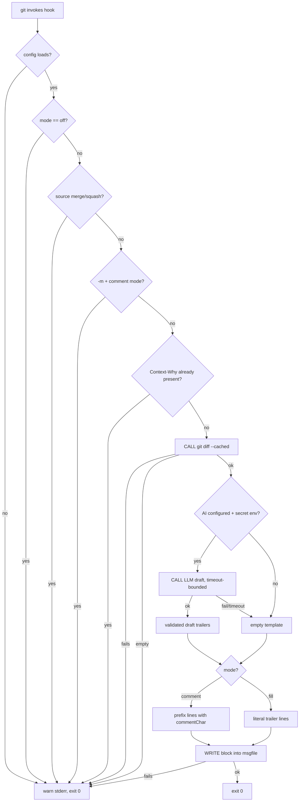

# CLI & Commit Hook Design v0.1

Status: Draft (design only — not yet implemented)
Depends on: [Context Trailer Format v0.1](trailer-format.md)

## Goal

Make writing `Context-*` trailers cheap enough that developers actually do it:
an AI-assisted draft appears in the commit editor; the developer reviews,
edits, and commits. The tool must be invisible when it works and harmless when
it fails.

## Invariants

- **I-1 Never block.** No tool failure (missing config, AI outage, timeout,
  IO error) may block or break a commit. Every hook failure path prints a
  warning to stderr and exits 0. Sole exception: `commit-msg` lint with
  opt-in `lint.level = "strict"`.
- **I-2 Explicit approval.** AI-drafted content reaches a commit only after
  the developer sees it. Default mode renders drafts as comment lines the
  developer must uncomment.
- **I-3 AI-optional.** With no AI configured, hooks degrade to an empty
  trailer template. Every feature except drafting works offline.
- **I-4 Privacy is opt-in.** Staged diffs leave the machine only when the
  user has configured an AI provider *and* exported its secret env var.

## Command surface

One binary, `context-diary`:

| Command | Purpose |
| --- | --- |
| `context-diary init` | Install hooks into the current repo (coexistence-safe), scaffold `.context-diary.toml`. |
| `context-diary hook prepare-commit-msg <msgfile> [<source> [<sha>]]` | Git hook entry: inject trailer draft/template. |
| `context-diary hook commit-msg <msgfile>` | Git hook entry: lint final message (warn-only by default). |
| `context-diary draft [--staged]` | Print a trailer draft to stdout (manual use, scripting, other hook managers). |
| `context-diary lint <rev-range>` | Validate trailers over a commit range (CI). Exit 1 on violations. |
| `context-diary scopes` | List known scopes (config + history). |

Reserved for later phases: `serve` (indexer), `mcp` (MCP server).

Hook scripts installed by `init` are one-liners delegating to the binary, so
upgrades never require re-installing hooks.

## Configuration

Precedence: env vars > repo `.context-diary.toml` > user
`~/.config/context-diary/config.toml` > builtin defaults.

```toml
# .context-diary.toml — committed; never contains secrets
[hook]
mode = "comment"        # comment | fill | off

[ai]
provider = "anthropic"  # adapter name; empty = AI off
model = "claude-haiku-4-5"
timeout = "5s"          # hard budget for the draft call

[lint]
level = "warn"          # warn | strict

scopes = ["order/cancel", "payment/refund"]  # optional shared scope list
```

Secrets (API keys) come exclusively from env vars defined by the provider
adapter (e.g. `ANTHROPIC_API_KEY`). Config files never hold them.

## Flow: `hook prepare-commit-msg`

### Pseudocode

Greenfield — no existing code; external integration points are git's hook
interface and the trailer spec.

```text
P1  invoked by git with (msgfile, source, sha)              [git prepare-commit-msg interface]
P2  load config (env > repo > user > defaults)
P3    IF config unreadable/invalid -> stderr warn, exit 0           (I-1)
P4  IF hook.mode == "off" -> exit 0
P5  IF source in {"merge", "squash"} -> exit 0                      (machine-generated messages)
P6  IF source == "message" AND hook.mode == "comment" -> exit 0     (-m: editor never opens, comments stripped unseen)
P7  read msgfile
P8    IF read fails -> stderr warn, exit 0                          (I-1)
P9  IF message already has a Context-Why trailer -> exit 0          (amend/reword/--trailer)
P10 CALL git diff --cached --stat + patch (bounded size)
P11   IF call fails -> stderr warn, exit 0                          (I-1)
P12 IF staged diff empty -> exit 0                                  (--allow-empty)
P13 resolve commentChar via git config core.commentChar             (default "#")
P14 IF ai.provider set AND provider secret env present:             (I-3, I-4)
P15   CALL LLM draft(diff, branch name, scopes list, subject if any)
P16     IF call fails OR exceeds ai.timeout -> stderr note, draft = empty template
P17   ELSE draft = returned trailers (validated against trailer-format grammar;
        invalid lines dropped, noted on stderr)
P18 ELSE draft = empty template (Context-Why: / Context-Scope: stubs)
P19 IF hook.mode == "comment" -> prefix every draft line with commentChar
P20 ELSE (mode == "fill") -> keep literal trailer lines
P21 WRITE draft block into msgfile (before git's comment section)
P22   IF write fails -> stderr warn, exit 0                         (I-1)
P23 exit 0
```

Completeness check (per flow-design):

- Boundary inputs: absent `source`/`sha` (git omits them for plain `git
  commit`) — P5/P6 treat missing source as editor flow. Unreadable msgfile
  P8. Empty diff P12.
- Side effects: `CALL git diff` P11, `CALL LLM` P16, `WRITE msgfile` P22 —
  each has a failure arm with observable result (stderr + exit 0).
- Ordering: the only write is P21, last. Abort at any point leaves the
  message untouched; an aborted editor session discards everything. No
  partial state.
- Concurrency: git's index lock serializes commits per repo; the hook holds
  no shared state.
- Criteria map: I-1 → P3/P8/P11/P16/P22 · I-2 → P19 default · I-3 → P18 ·
  I-4 → P14.

### Proposed: prepare-commit-msg flow



## Flow: `hook commit-msg`

```text
L1 invoked by git with (msgfile)                            [git commit-msg interface]
L2 load config
L3   IF config unreadable -> exit 0                                 (I-1)
L4 parse trailer block per trailer-format.md
L5 collect violations: missing Context-Why, malformed scope slug,
   multiline value, unknown-but-malformed Context-* line
L6 IF no violations -> exit 0
L7 IF lint.level == "strict" -> print violations, exit 1            (commit rejected)
L8 ELSE print violations as warnings -> exit 0
```

All arms terminate; only L7 can block, and only by explicit opt-in.
`context-diary lint <rev-range>` reuses L4–L5 over each commit in the range
and exits 1 on any violation (CI gate, AC6).

## Flow: `init` (coexistence rules)

```text
N1 detect hooks path: core.hooksPath if set, else .git/hooks        [git config]
N2 FOR EACH hook in {prepare-commit-msg, commit-msg}:
N3   IF slot empty -> WRITE one-liner script with context-diary marker
N4     IF write fails -> report error, exit 1                       (init is interactive; failing loud is correct)
N5   ELSE IF existing file has our marker -> WRITE updated one-liner (idempotent re-init)
N6   ELSE (foreign hook: husky, lefthook, hand-written)
N7     -> do NOT modify; print the exact line to add manually
N8 IF .context-diary.toml absent -> WRITE scaffold with commented defaults
N9 print summary (installed / skipped / manual steps)
```

`init` never edits files it does not own (N6–N7): hook managers each have
their own config formats, and guessing wrong breaks other tools' upgrades.

## Implementation risks

- **R1 Commit latency.** LLM call adds up to `ai.timeout` (default 5s) to
  every editor commit. Mitigations: hard timeout (P15–P16), skip paths
  P4–P6/P9/P12, small default model. If still painful, a future async mode
  (draft cached by a pre-commit-time daemon) — out of scope now. [P15]
- **R2 `fill` mode + `-m`.** Unreviewed AI text enters history. Accepted:
  fill is explicit opt-in; default comment mode is exempt via P6. Documented
  in README when implemented. [P6, P20]
- **R3 commentChar `auto`.** git can auto-pick a comment char *after*
  prepare-commit-msg ran, invalidating our prefix choice. Rare config;
  detect `auto` and fall back to template-without-comments plus stderr note.
  unverified against git source — verify during implementation. [P13, P19]
- **R4 Diff size.** Huge staged diffs blow the LLM context and the hook's
  time budget. P10 bounds the patch (stat always, patch truncated at a byte
  cap); cap value decided at implementation. [P10]
- **R5 Existing-hook chaining.** We refuse to auto-chain (N6–N7). Cost:
  manual step for husky/lefthook users. Benefit: never corrupt another
  tool's managed files. [N6]
- **R6 Draft validity.** LLM may emit malformed trailers; P17 validates
  against the spec grammar and drops invalid lines rather than injecting
  garbage. [P17]

## Out of scope (this phase)

- `git commit --trailer` wrapper command (`context-diary commit`) — git
  already provides `--trailer`; revisit if template demand appears.
- Async draft daemon (R1 mitigation).
- Indexer (`serve`) and MCP server (`mcp`) designs — separate docs.
